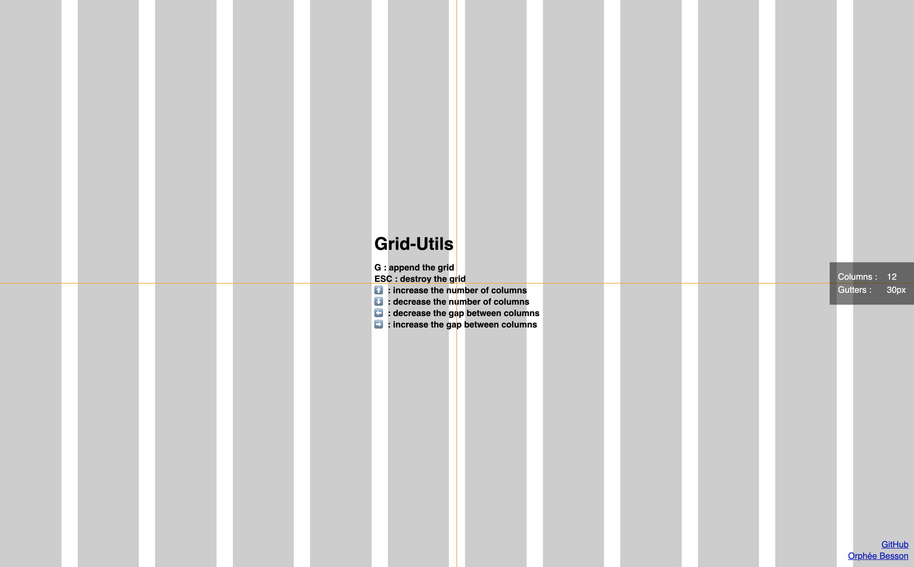

# :triangular_ruler: Grid-Utils

JavaScript utility tool to build beautiful layouts and best respect the proportions of the designs.



## :eyes: Demo

https://grid-utils.orpheebesson.fr

## :arrow_down: Installation

Import `grid-utils` in your project :

### Normal version

```
<script src="src/grid-utils.js"></script>
```

### Minified version

```
<script src="src/grid-utils.min.js"></script>
```

## :book: Documentation

Use the keys on your keyboard to play with the tool :

* G : append the grid
* ESC : destroy the grid
* :arrow_up: : increase the number of columns
* :arrow_down: : decrease the number of columns
* :arrow_left: : decrease the gap between columns
* :arrow_right: : increase the gap between columns

Enjoy !